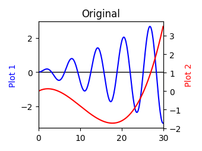
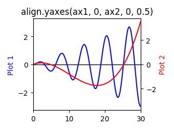
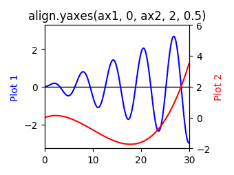
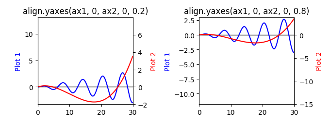
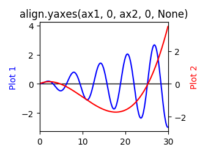

==================
Align module usage
==================

:py:mod:`mpl_axes_aligner.align` adjust the plotting range of two matplotlib axes to align their origins with the given position.

- :py:func:`.align.xaxes` for x-axes
- :py:func:`.align.yaxes` for y-axes

Align two y axes
================

In this section, :py:func:`.align.yaxes` is demonstrated by using the following plot:

.. code-block:: python

   import numpy as np
   import matplotlib.pyplot as plt

   x = np.arange(0.0, 30, 0.1)
   y1 = 0.1 * x * np.sin(x)
   y2 = 0.001*x**3 - 0.03*x**2 + 0.12*x

   fig = plt.figure()
   ax1 = fig.add_subplot(111)
   ax2 = ax1.twinx()

   ax1.plot(x, y1, color='blue', label='plot 1')
   ax2.plot(x, y2, color='red', label='plot 2')
   ax1.hlines(y=0, xmin=0, xmax=30, linewidth=1)

   ax1.set_ylabel('Plot 1', color='blue')
   ax2.set_ylabel('Plot 2', color='red')
   ax1.set_xlim(0.0, 30.0)

   plt.tight_layout()
   plt.show()

.. _align_yaxes_usage:

When you want to align y = 0 point of left and right y axes, use :py:func:`.align.yaxes`:

.. code-block:: python
   :emphasize-lines: 3,21-25

   import numpy as np
   import matplotlib.pyplot as plt
   from mpl_axes_aligner import align

   x = np.arange(0.0, 30, 0.1)
   y1 = 0.1 * x * np.sin(x)
   y2 = 0.001*x**3 - 0.03*x**2 + 0.12*x

   fig = plt.figure()
   ax1 = fig.add_subplot(111)
   ax2 = ax1.twinx()

   ax1.plot(x, y1, color='blue', label='plot 1')
   ax2.plot(x, y2, color='red', label='plot 2')
   ax1.hlines(y=0, xmin=0, xmax=30, linewidth=1)

   ax1.set_ylabel('Plot 1', color='blue')
   ax2.set_ylabel('Plot 2', color='red')
   ax1.set_xlim(0.0, 30.0)

   # Adjust the plotting range of two y axes
   org1 = 0.0  # Origin of first axis
   org2 = 0.0  # Origin of second axis
   pos = 0.5  # Position the two origins are aligned
   align.yaxes(ax1, org1, ax2, org2, pos)

   plt.tight_layout()
   plt.show()

:py:func:`.shift.yaxis` is called in :py:func:`.align.yaxes`.
The argument ``expand`` is always ``True`` (:ref:`shift_expand`).

Argumetns 1, 3: Axes (``ax1`` and ``ax2``)
------------------------------------------

The first and third arguments of :py:func:`.align.yaxes` (``ax1`` and ``ax2``) are the ``matplotlib.axes.Axes`` objects which you want to change.

Argumetns 2, 4: Origins (``org1`` and ``org2``)
-----------------------------------------------

The second and fourth arguments of :py:func:`.align.yaxes` (``org1`` and ``org2``) are the origins which you want to align.

Argument 5: Relative position (``pos``)
---------------------------------------

The last argument of :py:func:`.align.yaxes` (``pos``) is the relative position which the two origins are aligned.
``pos`` should satisfy the condition :math:`0 < pos < 1` (See also :ref:`shift_pos`).

``pos`` is optional argument, therefore, when ``pos`` is ``None``, the two origins are aligned with the middle of them.

Align two x axes
================

:py:func:`.align.xaxes` adjust the plotting range of two x axes.
The usage is same as :ref:`y axes<align_yaxes_usage>`.
