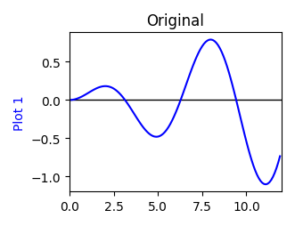
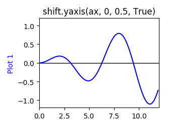
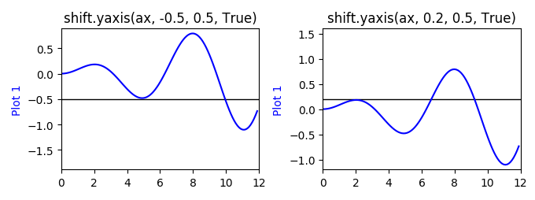
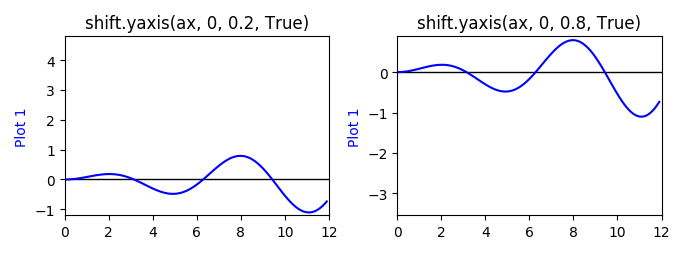
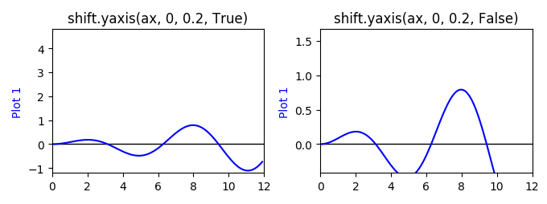

==================
Shift module usage
==================

:py:mod:`mpl_axes_aligner.shift` expands or shifts the plotting range of a matplotlib axis to align the origin with the given position.

- :py:func:`.shift.xasis` for x-axis
- :py:func:`.shift.yasis` for y-axis

Shift y axis
============

In this section, :py:func:`.shift.yaxis` is demonstrated by using the following plot:

.. code-block:: python

   import numpy as np
   import matplotlib.pyplot as plt

   x = np.arange(0.0, 12, 0.1)
   y = 0.1 * x * np.sin(x)

   fig = plt.figure()
   ax = fig.add_subplot(111)

   ax.plot(x, y, color='blue', label='plot 1')
   ax.hlines(y=0, xmin=0, xmax=30, linewidth=1)

   ax.set_ylabel('Plot 1', color='blue')
   ax.set_xlim(0.0, 12.0)

   plt.tight_layout()
   plt.show()

.. _shift_yaxis_usage:

When you want to shift y = 0 to the center of figure, use :py:func:`.shift.yaxis`:

.. code-block:: python
   :emphasize-lines: 3,17-21

   import numpy as np
   import matplotlib.pyplot as plt
   from mpl_axes_aligner import shift

   x = np.arange(0.0, 12, 0.1)
   y = 0.1 * x * np.sin(x)

   fig = plt.figure()
   ax = fig.add_subplot(111)

   ax.plot(x, y, color='blue', label='plot 1')
   ax.hlines(y=0, xmin=0, xmax=30, linewidth=1)

   ax.set_ylabel('Plot 1', color='blue')
   ax.set_xlim(0.0, 12.0)

   # Adjust the plotting range of two y axes
   org = 0.0  # Origin
   pos = 0.5  # Position the origins is aligned
   expand = True  # Switch the aligning method
   shift.yaxis(ax, org, pos, expand)

   plt.tight_layout()
   plt.show()

Argument 1: Axis (``ax``)
-----------------------------

The first argument of :py:func:`.shift.yaxis` (``ax``) is the ``matplotlib.axes.Axes`` object which you want to change.

Argument 2: Origins (``org``)
-----------------------------

The second argument of :py:func:`.shift.yaxis` (``org``) is the origin which you want to align.

.. _shift_pos:

Argument 3: Relative position (``pos``)
---------------------------------------

The third argument of :py:func:`.shift.yaxis` (``pos``) is the relative position which the origin is aligned.
When ``expand = True``, ``pos`` should satisfy the condition :math:`0 < pos < 1`, otherwise, ``pos`` should satisfy the condition :math:`0 \le pos \le 1`.
When ``pos`` is nearly 0, the origin is shifted to bottom, when ``pos`` is nearly 1, on the other hand, the origin is shifted to top.
When ``pos`` is 0.5, the origin is aligned at the center of figure.

.. _shift_expand:

Argument 4: Shifting method (``expand``)
----------------------------------------

The last argument of :py:func:`.shift.yaxis` (``expand``) toggle the origin shift method.
When ``expand = True``, the plotting range is adjusted without reducing plotting range, otherwise, the plotting range is simply shifted:

The mathematical details are explained here.
:math:`o` and :math:`p` are the given origin and relative position, respectively.
And, :math:`y_b` and :math:`y_t` are the initial values of bottom and top of the axis.
First, we calculate the relative position of the origin which represented by :math:`\bar{o}`:

.. math::
   \bar{o} = \frac{o - y_b}{y_t - y_b}

When ``expand = True``, the new values of bottom and top, :math:`y'_b` and :math:`y'_t`, are calculated to satisfy the condition :math:`\bar{o} = p`.
When :math:`\bar{o} > p`:

.. math::
   y'_t &= \frac{o + (p - 1) \times y_b}{p} \\
   y'_b &= y_b

When :math:`\bar{o} < p`:

.. math::
   y'_t &= y_t \\
   y'_b &= \frac{o - p \times y_t}{1 - p}

When ``expand = False``, the plotting range is simply shifted:

.. math::
   y'_t &= y_t + \var{o} - p \\
   y'_b &= y_b + \var{o} - p

Shift x axis
============

:py:func:`.shift.xaxis` adjust the plotting range of x axis.
The usage is same as :ref:`y axis<shift_yaxis_usage>`.
